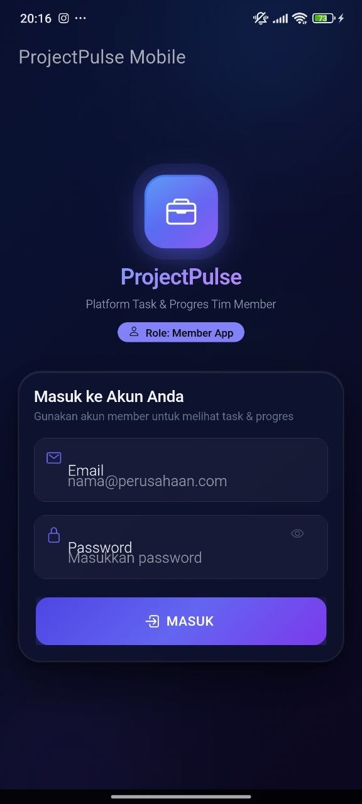
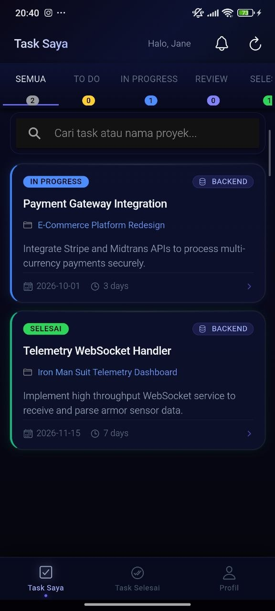

# ProjectPulse — Platform Manajemen Klien & Proyek Internal

**Take-Home Technical Test — Full Stack Developer**  
**Bilcode Technology · Seleksi Kandidat**

ProjectPulse adalah platform manajemen klien, proyek, dan tugas internal yang dirancang untuk menyelaraskan alur kerja antara **Project Manager / Admin** (via Dashboard Web) dan **Tim Member / Developer / Desain** (via Aplikasi Mobile Ionic). Platform ini terintegrasi dengan **Fitur ML (AI Task Breakdown)** berbasis Google Gemini API untuk membantu merincikan brief klien menjadi daftar tugas terstruktur secara otomatis.

---

## 🛠️ Tech Stack Utama

- **Backend API:** Laravel 13 (PHP 8.4) dengan Laravel Sanctum (Token Auth REST API)
- **Web Admin:** React 19 + Vite + Bootstrap 5 + React Router DOM v7
- **Mobile App:** Ionic Framework v7 + React 19 + Capacitor v7 _(Stack Utama)_
- **Database:** PostgreSQL 15 (Docker & Kubernetes)
- **ML / Integration:** Google Gemini API (`gemini-2.5-flash` dengan Fallback Sequence)
- **Containerization & Orchestration:** Docker, Docker Compose & Kubernetes (`k8s/`)

---

## 🚀 Panduan Menjalankan Aplikasi (Lokal & Cluster)

### 1. Prasyarat Sistem

- Docker & Docker Compose (v2.0+)
- Node.js (v18+) & NPM
- PHP (v8.2+) & Composer
- Kubernetes Cluster Lokal (Minikube / Kind / K3d) & `kubectl` (untuk opsi K8s)

---

### 2. Cara 1: Menjalankan via Docker Compose (Dev Lokal)

Cara paling cepat untuk menjalankan seluruh service (Database, Backend API, dan Web Frontend):

1. **Clone repository dan masuk ke direktori proyek:**

   ```bash
   git clone https://github.com/Afaandii/bilcode-test.git
   cd bilcode-test
   ```

2. **Jalankan Docker Compose:**

   ```bash
   docker-compose up --build -d
   ```

3. **Jalankan Migrasi & Seeder Database (Backend):**

   ```bash
   docker-compose exec backend php artisan migrate:fresh --seed
   ```

4. **Akses Layanan:**
   - **Web Admin Dashboard:** `http://localhost:3000`
   - **Backend API:** `http://localhost:8000`
   - **Health Check API:** `http://localhost:8000/health`

---

### 3. Cara 2: Deploy ke Cluster Kubernetes Lokal (`k8s/`)

Seluruh manifest Kubernetes telah siap dan diuji di folder `k8s/`.

1. **Pastikan Cluster Kubernetes Lokal Aktif (Minikube / Kind / K3d):**

   ```bash
   minikube start
   # atau kind create cluster
   ```

2. **Buat File Secret dari Contoh:**

   ```bash
   cp k8s/secret.example.yaml k8s/secret.yaml
   ```

   _(File `secret.yaml` sudah dimasukkan ke `.gitignore` sehingga aman dari komit)._

3. **Terapkan Seluruh Manifest Kubernetes:**

   ```bash
   kubectl apply -f k8s/
   ```

4. **Periksa Status Pod & Service:**

   ```bash
   kubectl get pods
   kubectl get svc
   kubectl get ingress
   ```

5. **Akses Service di Kubernetes:**
   - **Port-Forwarding Web:** `kubectl port-forward svc/projectpulse-web 3000:80` (Akses di `http://localhost:3000`)
   - **Port-Forwarding Backend:** `kubectl port-forward svc/projectpulse-backend 8000:8000` (Akses di `http://localhost:8000`)
   - **Ingress (Minikube):** Tambahkan entry `127.0.0.1 projectpulse.local` ke file `/etc/hosts` (Linux/Mac) atau `C:\Windows\System32\drivers\etc\hosts` (Windows), lalu buka `http://projectpulse.local`.

---

### 4. Cara Menjalankan Aplikasi Mobile (Ionic / Capacitor)

Aplikasi mobile berada di direktori `mobile/`.

1. **Masuk ke folder `mobile` dan instal dependensi:**

   ```bash
   cd mobile
   npm install
   ```

2. **Menjalankan di Browser (Development Mode):**

   ```bash
   npm run dev
   ```

   Aplikasi mobile dapat diakses di `http://localhost:5173` (aktifkan Responsive Device Mode di browser DevTools).

3. **Menjalankan di Emulator Android (via Capacitor):**
   ```bash
   npx cap copy
   npx cap open android
   ```
   _(Buka Android Studio, lalu klik tombol **Run** untuk menjalankan di Emulator Android)._

---

## 🔑 Akun Demo (Data Awal / Seeder)

Setelah menjalankan `php artisan db:seed`, gunakan akun berikut untuk mencoba sistem:

| Role                  | Email                  | Password   | Platform                                |
| --------------------- | ---------------------- | ---------- | --------------------------------------- |
| **Admin / PM**        | `admin@bilcode.com`    | `password` | Web Dashboard (`http://localhost:3000`) |
| **Member (Dev)**      | `member@bilcode.com`   | `password` | Mobile App (`http://localhost:5173`)    |
| **Member (Desainer)** | `designer@bilcode.com` | `password` | Mobile App (`http://localhost:5173`)    |

---

## 📋 Fitur Inti & Nilai Tambah (Bonus)

- [x] **Autentikasi & Otorisasi RBAC:** Token-based Sanctum Auth untuk role `admin` & `member`.
- [x] **Web Admin Dashboard:** CRUD Klien, CRUD Proyek, AI Brief Task Generator, Manajemen Task & Filter Status.
- [x] **Mobile App (Ionic):** Filter task tersisa/selesai, update status task (`todo` -> `in_progress` -> `review` -> `done`), catat log jam kerja, dan notifikasi in-app.
- [x] **Integrasi ML (AI Task Breakdown):** Google Gemini API dengan JSON Schema Output & Fallback Sequence otomatis.
- [x] **Kubernetes Deployment Manifests:** Complete manifests (`Deployment`, `Service`, `ConfigMap`, `Secret`, `Ingress`, `Database`, dan `HPA`).
- [x] **Health Check & Resiliency:** Endpoint `/health` untuk Kubernetes Probes & sistem fallback jika AI API timeout/gagal.
- [x] **Dokumentasi Arsitektur Lengkap:** File [docs/architecture.md](file:///c:/repo-github/bilcode-test/docs/architecture.md) menjelaskan alasan desain teknis & trade-off.

---

## 📁 Struktur Folder Repository

```
bilcode-test/
├── backend/                # Laravel 11 API Backend & LLM Client
│   ├── app/ml/             # TaskBreakdownClient (Google Gemini Integration)
│   ├── routes/api.php      # API Endpoint Routes
│   ├── Dockerfile
│   └── .env.example
├── web/                    # React 19 + Vite Admin Dashboard
│   ├── src/                # Pages, Components, & Services
│   └── Dockerfile
├── mobile/                 # Ionic Framework v8 Mobile App
│   └── src/                # Screens, Components, & Services
├── k8s/                    # Kubernetes Manifests
│   ├── backend-deployment.yaml
│   ├── backend-service.yaml
│   ├── web-deployment.yaml
│   ├── web-service.yaml
│   ├── db-deployment.yaml
│   ├── db-service.yaml
│   ├── configmap.yaml
│   ├── secret.example.yaml
│   ├── ingress.yaml
│   └── hpa.yaml
├── docs/
│   └── architecture.md     # Dokumentasi Keputusan Arsitektur
├── docker-compose.yml      # Development Environment Setup
└── README.md               # Dokumen Utama Submission
```

---

## 📱 Demo & Screenshot Mobile App

| Halaman Login Mobile                              | Daftar & Detail Task Mobile                               |
| ------------------------------------------------- | --------------------------------------------------------- |
|  |  |

---

## 📚 Dokumentasi API, Arsitektur & Portofolio

- **Dokumentasi API (Postman Collection):** Berkas Postman Collection telah disertakan dan dapat di-import langsung dari [docs/bilcode-api-docs.postman_collection.json](file:///c:/repo-github/bilcode-test/docs/bilcode-api-docs.postman_collection.json).
- **Dokumentasi Arsitektur Lengkap:** Buka file [docs/architecture.md](file:///c:/repo-github/bilcode-test/docs/architecture.md) untuk mempelajari keputusan teknis, alur data, skema database, dan strategi resiliensi.
- **Portofolio Kandidat:** [https://ahmad-afandi.vercel.app](https://ahmad-afandi.vercel.app)
